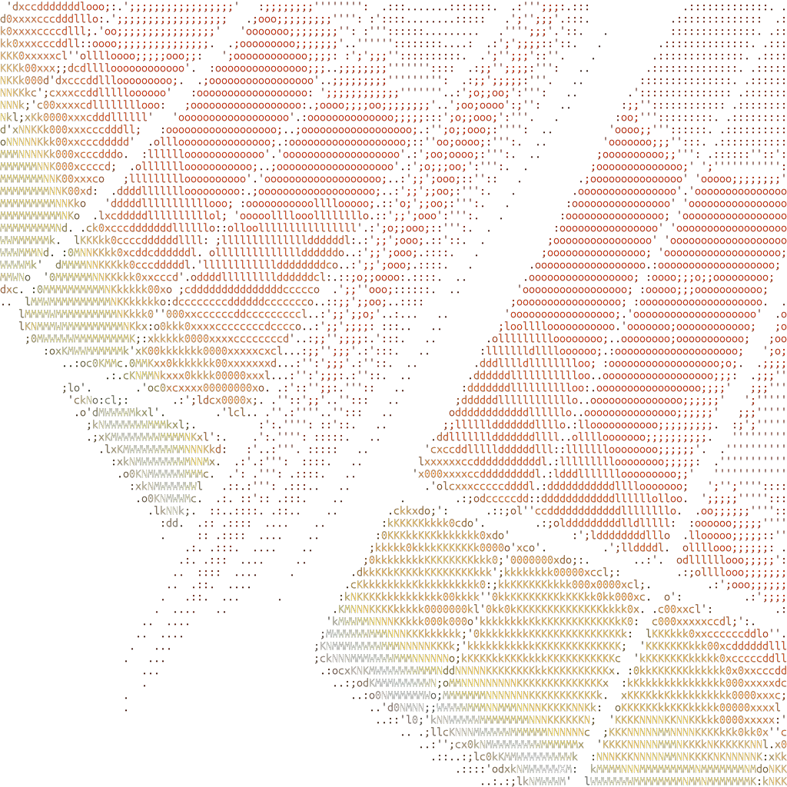
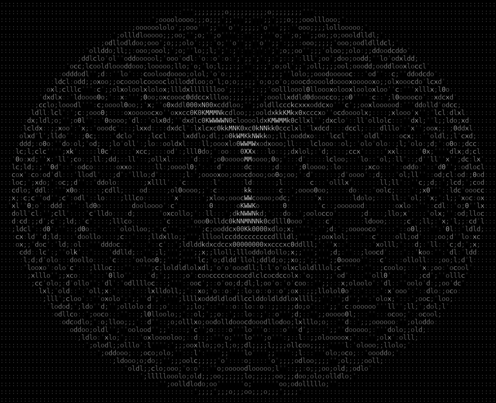

# imgii

imgii is an image rendering program that renders colored ANSI-encoded ASCII art as a PNG and saves the output file.
Supports popular image types, such as PNG, JPEG, GIF, WEBP, and more.

## Building

Requires the Rust compiler.

```bash
git clone https://github.com/Stattek/imgii.git
cd imgii
# it's recommended to use a release build to run this program
cargo build --release
```

## Usage

```text
Usage: imgii [OPTIONS] <INPUT_FILENAME> <OUTPUT_FILENAME> [FINAL_IMAGE_INDEX]

Arguments:
  <INPUT_FILENAME>
          Path to the input image

          Can also specify a format for an input, if <FINAL_IMAGE_INDEX> is also set to the final input image index.

          Example: "input_image%d.png"

  <OUTPUT_FILENAME>
          Path to the output image

          Can also specify a format for an input, if <FINAL_IMAGE_INDEX> is also set to the final input image index (will use the same index as the original image).

          Example: "output_image%d.png"

  [FINAL_IMAGE_INDEX]
          Allows for converting multiple images. Specifies the final input image index. Index starts at 1

Options:
  -w, --width <WIDTH>
          Width (in characters) of the output image. To retain the image's original aspect ratio, only set this value.

          Defaults to 128 if width and height are not specified.

  -H, --height <HEIGHT>
          Height (in characters) of the output image, if not specified, it will be calculated to keep the aspect ratio

  -f, --font-size <FONT_SIZE>
          The font size of the output image. Larger font sizes incur harsher performance penalties.

          By default, uses a font size of 16.

  -i, --invert
          Inverts the weights of the characters. Useful for white backgrounds

  -b, --background
          Sets a black background behind the image.

          No background by default.

  -C, --charset <CHARSET>
          Characters used to render the image, from transparent to opaque. Built-in charsets: [block, emoji, default, russian, slight, minimal]

          [default: minimal]

  -o, --char-override <CHAR_OVERRIDE>
          Character override. Ignores the current charset and repeats the desired string for the entirety of the output image

  -h, --help
          Print help (see a summary with '-h')

  -V, --version
          Print version
```

### Simple Example

```bash
# Makes assumptions about how to convert the image.
cargo run --release -- input_img.png output_ascii_img.png
```

### Examples Using Arguments

```bash
# renders an image with a width of 150 characters, using the block charset.
# NOTE: Just setting --width will maintain the aspect ratio of the input
cargo run --release -- --charset block --width 100 input_img.png output_ascii_img.png

# Sets a background behind the result, can often look better
cargo run --release -- --background input.gif output_ascii.gif

# Forces the output to have a width of 10 characters and a height of 100 characters.
cargo run --release -- --width 10 --height 100 input.gif output_ascii.gif
```

### Example With More Verbose Output

```bash
# Running with debug logs enabled
RUST_LOG=debug cargo run --release -- --background input_img.png output_ascii_img.png

# Running with info logs enabled
RUST_LOG=info cargo run --release -- --background input_img.png output_ascii_img.png
```

## Supported Output Image Types

imgii can currently output the following filetypes: \[png, gif\].

### Specifying Output Image Type

Specifying an output type can be done simply by changing the filetype in the output filename (in a similar way to `ffmpeg -i input.png output.gif` converting a png to gif).

```bash
# Takes an input GIF and imgii will convert to an output GIF
cargo run --release -- input.gif output.gif
```

## Example Output

Original Image:


Output:



Others:


